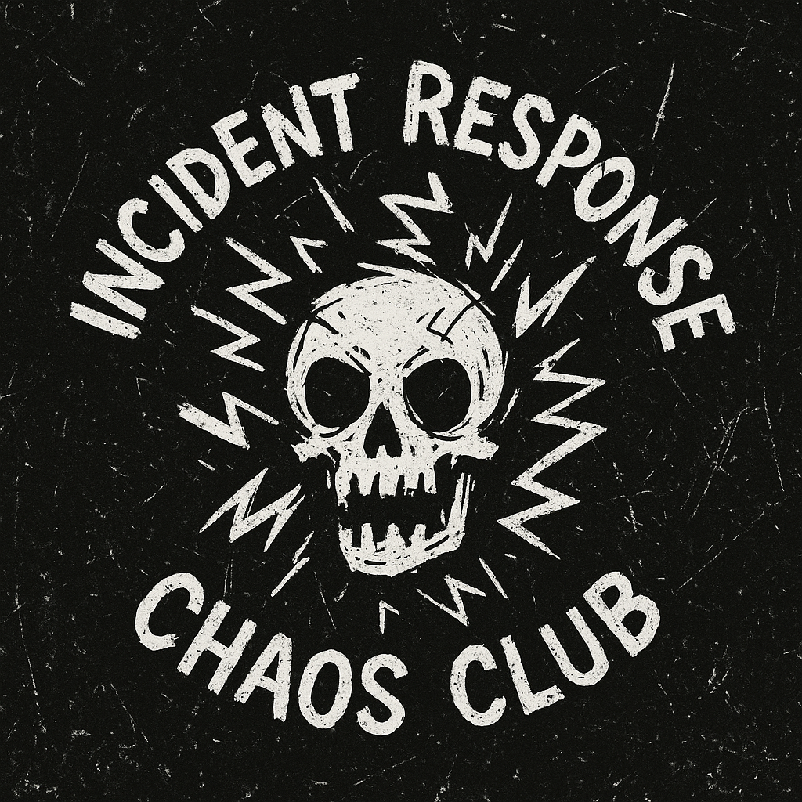

<div align="center">
  
  
  # Incident Response Chaos Club
  
  > A community-driven DFIR (Digital Forensics & Incident Response) knowledge aggregator
  
  [](https://irchaos.club/)
  [](https://github.com/irchaosclub)
  [](https://nextjs.org/)
</div>

## Project Goal

We're solving a fundamental problem in the DFIR community:

**The Problem:** Finding quality DFIR content is fragmented and frustrating. Security researchers and practitioners either:
- Don't publish their knowledge due to lack of website expertise or resources
- Publish on scattered personal blogs that are hard to discover and track

**Our Solution:** [irchaos.club](https://irchaos.club/) serves as a centralized DFIR knowledge aggregator where security professionals can:
- **Publish directly** on our platform with full Markdown support
- **Create external link entries** to showcase content hosted elsewhere  
- **Gain visibility** through our growing community
- **Discover quality content** in one centralized location

Whether you're sharing malware analysis, incident response procedures, threat hunting techniques, or security research, IRChaos Club provides the platform and audience your work deserves.

## Quick Start

### Prerequisites
- **Node.js** 18.x or later
- **npm** or **yarn**

### Local Development

1. **Clone the repository**
   ```bash
   git clone https://github.com/irchaosclub/irchaosclub.github.io.git
   cd irchaosclub.github.io
   ```

2. **Install dependencies**
   ```bash
   npm install
   # or
   yarn install
   ```

3. **Start the development server**
   ```bash
   npm run dev
   # or
   yarn dev
   ```

4. **Open your browser**
   Navigate to [http://localhost:3000](http://localhost:3000) to see the site running locally.

### Build for Production

```bash
npm run build
npm run start
```

---

<div align="center">
  <h2>Contributing Content</h2>
  <p>Want to share your DFIR knowledge with the community? We have two ways to contribute.</p>
</div>

---

## Check the Wiki
For detailed instructions on adding articles, please visit our **[Wiki](https://github.com/irchaosclub/irchaosclub.github.io/wiki)** which covers:

- **Direct Articles**: How to write and publish full articles on the platform
- **External Links**: How to create entries that link to your existing blog posts
- **Formatting Guidelines**: Markdown syntax, image handling, and styling
- **Metadata & Tags**: Proper categorization for discoverability

### Quick Overview

1. **Direct Articles**: Create a new `.md` file in `/content/your-article-name/`
2. **External Links**: Add frontmatter with `external: "https://your-blog.com/post"`
3. **Images**: Place in `/public/images/your-article-name/` 
4. **Submit**: Create a pull request with your content

## Tech Stack

- **Framework**: [Next.js](https://nextjs.org/) 13+ with App Router
- **Content**: [Contentlayer](https://contentlayer.dev/) for Markdown processing  
- **Styling**: [Tailwind CSS](https://tailwindcss.com/) + [shadcn/ui](https://ui.shadcn.com/)
- **Deployment**: GitHub Pages with static export
- **Language**: TypeScript

## Project Structure

```
irchaosclub.github.io/
├── content/                    # Blog posts and articles
│   ├── your-article/
│   │   ├── index.md            # Article content
│   │   └── images/             # Article-specific images
├── src/
│   ├── components/             # React components
│   ├── pages/                  # Next.js pages
│   ├── styles/                 # Global styles
│   └── lib/                    # Utility functions
├── public/
│   └── images/                 # Static images
├── contentlayer.config.ts      # Content processing config
└── next.config.js              # Next.js configuration
```

## Community

- **Website**: [irchaos.club](https://irchaos.club/)
- **GitHub**: [irchaosclub](https://github.com/irchaosclub)
- **Issues**: [Report bugs or request features](https://github.com/irchaosclub/irchaosclub.github.io/issues)
- **Discussions**: [Community discussions](https://github.com/irchaosclub/irchaosclub.github.io/discussions)

## License

This project is open source and available under the [MIT License](LICENSE).

## Acknowledgments

Special thanks to all the security researchers, incident responders, and DFIR practitioners who contribute their knowledge to make our community stronger.

---

**Ready to share your DFIR expertise?** Check out our [Wiki](https://github.com/irchaosclub/irchaosclub.github.io/wiki) to get started!